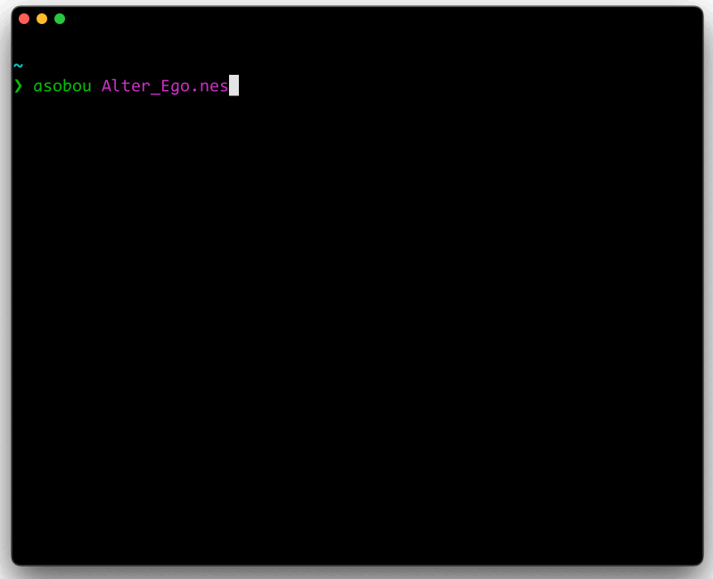

<p align="center">
  <picture>
    <source media="(prefers-color-scheme: dark)" srcset="docs/images/logo-white.svg">
    
  </picture>
</p>

---

<p align="center">
  <a href="license"></a>
  <a href="https://github.com/arianrhodsandlot/asobou/actions">
    
  </a>
  <a href="https://crates.io/crates/asobou">
    
  </a>
  <a href="https://www.npmjs.com/package/asobou"></a>
  <a href="https://github.com/arianrhodsandlot/asobou/releases">
    
  </a>
</p>

<p align="center">Play retro games directly in your terminal</p>

<p align="center">
  
</p>

> [!note]
>
> The game we are using for demonstration here is <i><a href="https://www.romhacking.net/homebrew/1/">Alter Ego</a></i>.

## Overview

Asobou is a command-line tool that allows you to play retro games directly in your terminal. Simply run:

```sh
asobou 'Super Mario Bros.zip'
```

Asobou detects the system, ensures a suitable emulator is available, picks the best renderer your terminal supports, and starts the game.

## Prerequisites

- Asobou works best with terminals that support [Terminal graphics protocol](https://sw.kovidgoyal.net/kitty/graphics-protocol/). Here is an incomplete list of supported terminals (sorted alphabetically):
  - [Ghostty](https://ghostty.org/) (Linux, macOS)
  - [iTerm2](https://iterm2.com/) (macOS)
  - [Kitty](https://sw.kovidgoyal.net/kitty/) (Linux, macOS)
  - [Rio Terminal](https://rioterm.com/) (Linux, macOS, Windows)
  - [WezTerm](https://wezfurlong.org/wezterm/) (Linux, macOS, Windows)
- Asobou requires an active internet connection to download emulator binaries from http://buildbot.libretro.com/ when needed.
- Asobou requires you to provide the game file(s), as it does not bundle any game content.

## Installation

You do not necessarily need to install it if you just want a quick try with [npx](https://docs.npmjs.com/cli/v12/commands/npx):

```sh
npx asobou
```

From [npm](https://www.npmjs.com/package/asobou):

```sh
npm install asobou -g
```

From [crates.io](https://crates.io/crates/asobou):

```sh
cargo install asobou
```

With [mise](https://mise.jdx.dev/):

```sh
mise use github:arianrhodsandlot/asobou -g
```

## Usage

Here are some typical usage examples:

Start a game

```sh
asobou 'Super Mario Bros.zip'
```

Start a game and render as ASCII characters

```sh
asobou 'Streets of Rage 2.md' --renderer=ascii
```

Run with an explicit core

```sh
asobou 'Super Castlevania IV.zip' --core=snes9x
```

Load a save state at startup

```sh
asobou 'Super Metroid.sfc' --state=~/backup.state
```

Load the latest managed state at startup

```sh
asobou 'Super Metroid.sfc' --resume
```

Download and play a homebrew game

```sh
asobou brew flappybird.nes
```

Install a libretro core

```sh
asobou core install genesis_plus_gx
```

Set a configuration value

```sh
asobou config set rewind.buffer_size_mb 64
```

List saved states, filtered

```sh
asobou state list 'Pokemon Emerald.gba' --core=mgba
```

## Configuration

Asobou loads the first applicable config path:

1. The exact path in the `ASOBOU_CONFIG` environment variable
2. `$XDG_CONFIG_HOME/asobou/config.toml`
3. `~/.config/asobou/config.toml` on Linux and macOS
4. `%APPDATA%\asobou\config.toml` on Windows

The config file is optional and an omitted setting keeps its default. Explicit command-line values override configuration values.

```toml
[input]
# Each input takes one standalone key, and a key cannot be assigned to more than one input.
# Keys follow the RetroArch conventions. Printable characters are written directly; the other supported names are:
# space enter escape tab backspace
# up down left right home end pageup pagedown insert del
# f1 through f24
# num0 through num9
# period comma slash minus equals leftbracket backslash rightbracket
# backquote quote semicolon tilde
# capslock numlock print_screen scroll_lock pause menu
# shift rshift ctrl rctrl alt ralt
# left-super right-super left-hyper right-hyper left-meta right-meta iso-level-3-shift iso-level-5-shift
# numpad-0 through numpad-9        keypad0 through keypad9
# numpad-decimal  kp_period        numpad-divide  divide
# numpad-multiply  multiply        numpad-subtract  kp_minus
# numpad-add  kp_plus              numpad-enter  kp_enter
# numpad-equal  kp_equals          numpad-comma
# numpad-up  numpad-down  numpad-left  numpad-right
# numpad-home  numpad-end  numpad-page-up  numpad-page-down
# numpad-insert  numpad-delete  numpad-begin
up = "up"
down = "down"
left = "left"
right = "right"
a = "x"
b = "z"
x = "s"
y = "a"
start = "enter"
select = "rshift"
l = "q"
r = "w"
quit = "escape"
rewind = "r" # Hold to rewind
save_state = "f2" # Save a new state to data_dir
load_state = "f4" # Load the newest state

# Optional buttons, unbound by default:
# l2 = "e"
# r2 = "u"
# l3 = "t"
# r3 = "y"

[display]
renderer = "auto" # auto, graphic, block, ascii, or debug
fps = 60 # Maximum terminal refresh rate, from 1 to 240
primary_screen = false # Use the primary buffer when true

[audio]
muted = false # Disable game audio when true

[status]
# The status text is centered and dimmed over the bottom of the rendered frame.
# Set `status.enabled` to `false` to hide both lines, or toggle `gamepad` and
# `controls` independently. Save and load notifications remain visible when the
# keybinding status is hidden. Notifications are anchored to the bottom-left and
# do not change the centered keybindings' position.
enabled = true # Show the on-screen keybinding status
gamepad = true # Show gamepad inputs on the upper status line
controls = true # Show save, load, rewind, and exit on the lower line

[rewind]
# Rewind steps back while the rewind key is held. A higher `granularity` uses
# less memory and CPU but rewinds in coarser steps; once `buffer_size_mb` is
# reached the oldest snapshots are dropped. Disabling rewind frees the key for
# other bindings and hides it from the on-screen status line.
enabled = true # Snapshot-based rewind
granularity = 2 # Frames between snapshots
buffer_size_mb = 20 # Memory cap for stored snapshots

[state]
save_on_exit = false # Save a state when exiting cleanly

[paths]
# Data lives in `$XDG_DATA_HOME/asobou` and cache in `$XDG_CACHE_HOME/asobou` by
# default (`~/Library/Application Support/asobou` and `~/Library/Caches/asobou` on
# macOS, `~/.local/share/asobou` and `~/.cache/asobou` on Linux). `paths.data_dir`
# and `paths.cache_dir` override the base directory: cores and save states go
# under `data_dir/cores` and `data_dir/states`, brew downloads under
# `cache_dir/brew`. Values must be absolute or start with `~/`. These settings
# take precedence over the `XDG_DATA_HOME` and `XDG_CACHE_HOME` environment
# variables, which are used only when the corresponding key is unset (an empty
# variable counts as unset).
data_dir = "~/asobou-data" # Override the data base (cores, save states)
cache_dir = "~/asobou-cache" # Override the cache base (brew downloads)
```

## Under the hood

Asobou is a [libretro frontend](https://docs.libretro.com/development/frontends/): the emulation itself is performed by libretro cores, shared libraries such as `nestopia_libretro.so` (for Linux) / `snes9x_libretro.dylib` (for macOS) / `mgba_libretro.dll` (for Windows), which Asobou locates, loads, and drives, turning their output into something a terminal can display.

Emulation and rendering run on separate threads: the emulation thread captures video only when the renderer requests a frame, and hands the latest frame to the render thread through a mailbox. The active renderer then draws it:

- `graphic` — sends the frame as a PNG via the [Terminal graphics protocol](https://sw.kovidgoyal.net/kitty/graphics-protocol/)
- `block` — downsamples the frame into colored half-block cells(▀)
- `ascii` — maps pixel brightness to ASCII characters

## Credits

- [libretro](https://www.libretro.com/) and its friends (the emulation cores)
- [Terminal graphics protocol](https://sw.kovidgoyal.net/kitty/graphics-protocol/) proposed by [Kitty](https://sw.kovidgoyal.net/kitty/)

## License

[MIT](license)
